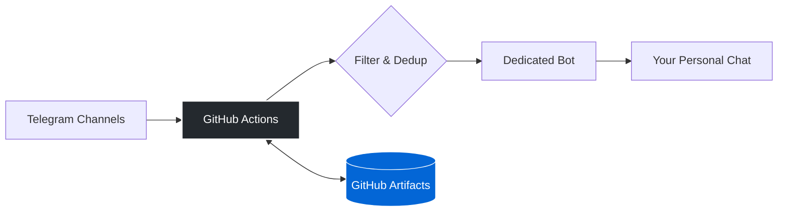

# Telegram Job Digest Bot

An automated Python script that aggregates job postings from selected Telegram channels, filters them by specific frontend keywords (Angular, React, etc.), removes duplicates, and sends a clean daily digest via a dedicated Telegram **Bot** directly to your personal chat account, keeping your "Saved Messages" clean.

## Key Features
* **Smart Filtering:** Matches jobs based on precise keywords.
* **Deduplication:** Uses MD5 hashing of post content to ensure you never see the same vacancy twice, even if posted in multiple channels.
* **Compact Layout:** Caps job descriptions at 250 characters and formats titles into clean, clickable hyperlinks using Markdown (`parse_mode="md"`).
* **State Management:** Remembers the last run time using GitHub Artifacts so you only get new vacancies since the last execution.
* **100% Serverless & Free:** Runs completely on GitHub Actions via cron schedules—no paid VPS or server required.
* **Secure:** Your personal phone number, API keys, bot tokens, and session data are fully encrypted using GitHub Secrets and never exposed in the public repository.

---

## Technical Architecture

The script uses **Telethon** (Telegram Client API) to scan channels from your account, processes the data, and then authenticates as a Bot to securely deliver the formatted digest to you. It is triggered once a day by GitHub Actions and shuts down immediately after completion.



---

## Local Setup (First Interactive Run)

Before deploying to GitHub Actions, you must perform a one-time interactive login to generate your Telegram user session file.

### 1. Install Dependencies
```bash
pip install telethon python-dotenv
```

### 2. Configure Environment
Create a `.env` file in the root directory (this file is automatically ignored by Git for security):
```env
TG_API_ID=your_api_id
TG_API_HASH=your_api_hash
TG_PHONE=+your_phone_number
TG_BOT_TOKEN=your_bot_token_from_botfather
TG_USER_ID=your_numerical_telegram_id
```
*Note: You can get your numerical `TG_USER_ID` by starting the `@userinfobot` in Telegram.*

### 3. Run Locally
Execute the script for the first time:
```bash
python3 telegram_job_digest.py
```
* **Note:** The terminal will interactively ask for the confirmation code sent to your Telegram app (and your 2FA password if enabled).
* Once successful, it will generate the necessary session files locally and send the digest through your bot.

---

## GitHub Actions Deployment

1. Encode your local `.session` file to Base64 to store it securely:
   ```bash
   base64 -i job_digest_session.session -o session_base64.txt
   ```
2. Go to your GitHub Repository -> **Settings** -> **Secrets and variables** -> **Actions**.
3. Add the following **Repository Secrets**:
   * `TG_API_ID`
   * `TG_API_HASH`
   * `TG_PHONE`
   * `TG_BOT_TOKEN`
   * `TG_USER_ID`
   * `TG_SESSION_BASE64` (Paste the content of `session_base64.txt`)
4. Go to **Settings** -> **Actions** -> **General** -> **Workflow permissions**, select **Read and write permissions**, and save.
5. Push `telegram_job_digest.py`, `.github/workflows/run_digest.yml`, and `.gitignore` to your repository.

The workflow is pre-configured to run automatically every day at **09:27 UTC** (12:27 MSK/Minsk) to avoid server high-traffic hours. You can also trigger it manually anytime using the **"Run workflow"** button in the Actions tab.
